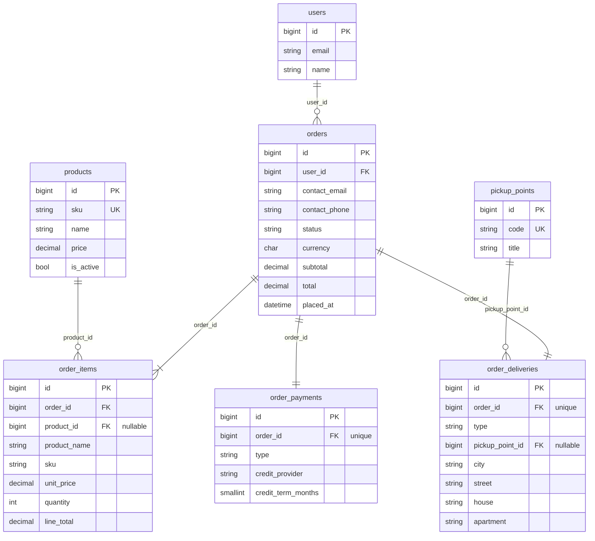
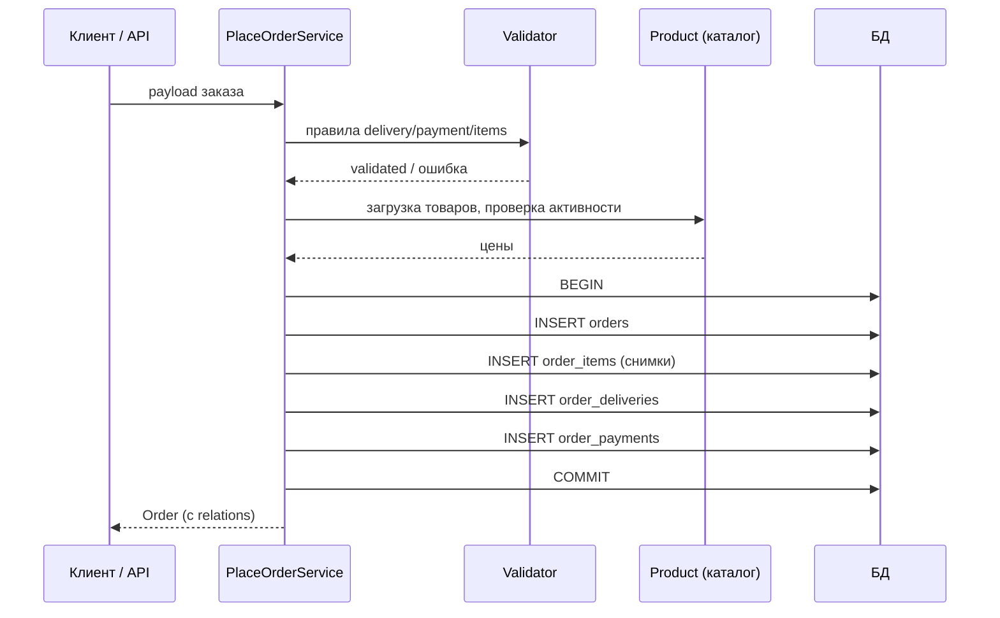
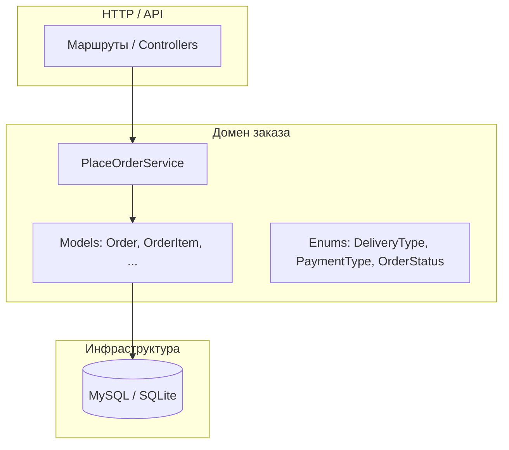

# Оформление заказа: модель данных, декомпозиция, логика

## Декомпозиция по сущностям и зонам ответственности

| Зона | Сущности / артефакты | Ответственность |
|------|----------------------|-----------------|
| **Идентичность** | `users` | Учётная запись; связь заказов с покупателем. |
| **Каталог** | `products` | Актуальная цена и атрибуты товара; FK из позиций заказа. |
| **Справочник ПВЗ** | `pickup_points` | Валидный идентификатор пункта выдачи (`code` + PK для FK). |
| **Заказ (агрегат)** | `orders` | Заголовок: пользователь, контакты на момент заказа, статус, суммы, валюта. |
| **Состав заказа** | `order_items` | Позиции: снимок названия/SKU и **зафиксированная** цена/количество/сумма строки. |
| **Доставка** | `order_deliveries` | Ровно одна запись на заказ; тип `pickup` \| `address` и соответствующие поля. |
| **Оплата** | `order_payments` | Ровно одна запись на заказ; тип `card` \| `credit` и поля кредита при необходимости. |
| **Прикладной слой** | `App\Services\Orders\PlaceOrderService` | Валидация входа, расчёт сумм из каталога (защита от подмены цены), транзакция сохранения. |

Расширяемость: новые способы доставки/оплаты — отдельные таблицы-детали (STI) или полиморфная связь; новые статусы заказа — enum/таблица `order_statuses`; налоги/скидки — отдельные таблицы или поля в `orders` / `order_items`.

## Таблицы и связи

- **`users` (1) — (N) `orders`**: заказ всегда привязан к пользователю (`user_id`).
- **`orders` (1) — (N) `order_items`**: состав заказа; позиция может ссылаться на `products` (`product_id`, `ON DELETE SET NULL`), имя и цена дублируются в строке как снимок.
- **`orders` (1) — (1) `order_deliveries`**: уникальный `order_id`; для `pickup` заполняется `pickup_point_id`, адресные поля `NULL`; для `address` — город/улица/дом/(квартира), `pickup_point_id` = `NULL`.
- **`pickup_points` (1) — (N) `order_deliveries`**: выбор ПВЗ при самовывозе.
- **`orders` (1) — (1) `order_payments`**: уникальный `order_id`; для `card` поля кредита `NULL`; для `credit` — `credit_provider`, `credit_term_months`.

## Базовая логика оформления заказа

1. **Вход**: `user_id`, контактные `contact_email` / `contact_phone`, список позиций `{ product_id, quantity }`, блок `delivery` (тип + поля по типу), блок `payment` (тип + поля для кредита).
2. **Проверки**: существование пользователя; непустой состав; товары существуют и **активны**; согласованность типа доставки и полей (ПВЗ только для самовывоза, адрес только для доставки); согласованность оплаты (кредитные поля только для кредита); форматы email/телефона и лимиты строк.
3. **Расчёт**: цена строки и итоги берутся из БД каталога (`products.price`), не из запроса клиента — снимок пишется в `order_items`.
4. **Сохранение (одна транзакция)**: `orders` → массово `order_items` → `order_deliveries` → `order_payments`. При ошибке — откат. После успеха возможны асинхронные шаги (платёжный шлюз, уведомления) вне транзакции.

Реализация: `App\Services\Orders\PlaceOrderService`.

## ER-диаграмма (сущности и связи)

## Sequence diagram: оформление заказа

## UML: слои приложения (упрощённо)

## Запуск в Docker

1. Скопировать `.env.example` в `.env`, выставить `APP_KEY` (`php artisan key:generate` внутри контейнера или локально).
2. Для MySQL в compose: `DB_CONNECTION=mysql`, `DB_HOST=mysql`, `DB_DATABASE=fhtagn`, `DB_USERNAME=fhtagn`, `DB_PASSWORD=secret` (как в `docker-compose.yml`).
3. `docker compose up -d --build` (или `docker-compose`, если плагин Compose не установлен). При первом старте контейнер `app` сам выполнит `composer install`, если нет `vendor/`. Затем: `docker compose exec app php artisan migrate`.
4. Приложение: `http://localhost:8080` (порт задаётся `APP_PORT`).

Если сервис `app` не в `docker compose ps`, смотрите причину: `docker compose logs app` (часто — ошибка `composer install` или права на `storage`/`bootstrap/cache`). В `.env` на сервере логично выставить `DB_CONNECTION=mysql` и те же `DB_*`, что в compose (переменные из `environment` в compose всё равно перекрывают `.env` для БД).
